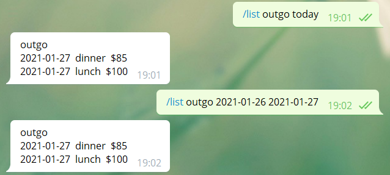
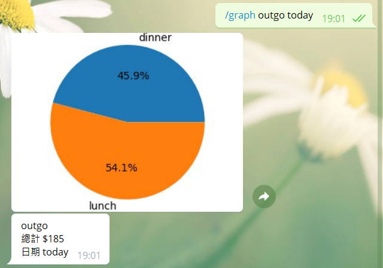

# Expenses Tracker

A telegram bot that tracks your expenses.

## Commands

### /help

```
/help [commnad]
```

the command that give help message of commnads to user.


### /outgo

```
/outgo [money] [category]
```

the command that add a outgo.


### /income

```
/income [money] [category]
```

the command that add a income.


### /list

```
/list [outgo/income] [time1] [time2]
/list [outgo/income] [time]
```

the command that list all outgo or income in the period of time1 and time2.

time1 must earlier than time2, otherwise, the command won't get anything. 

time format can be three type:
* 2021-01-01
* 2021-1-1
* 20210101

the second command is a simplified version of the first one, it use a single argument that must use special time format.

the special time format is a time period that we usually use:
* today
* yesterday
* week
* last_week
* month
* last_month



### /graph

```
/graph [outgo/income] [time1] [time2]
/graph [outgo/income] [time]
```

the command that count up all outgo or income in the period of time1 and time2, and draw into pie chart.

its time format is the same as /list


